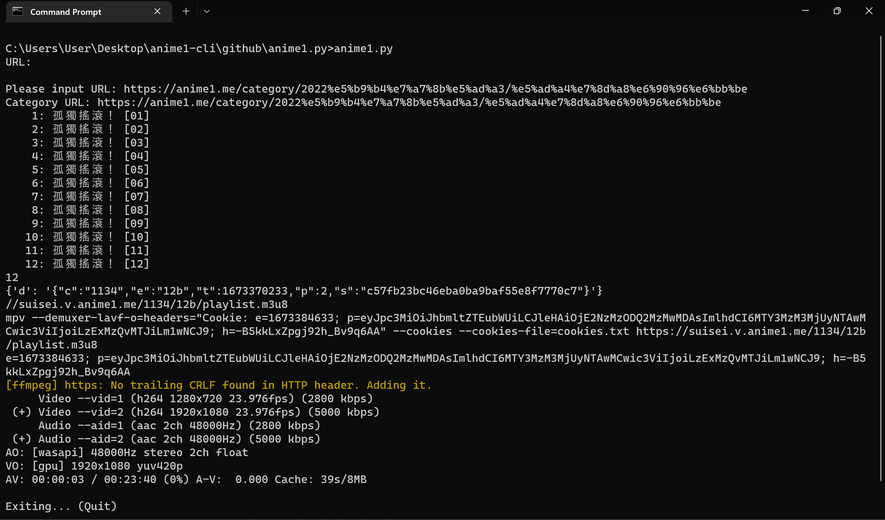

# anime1.py
CLI access to anime1.me (beta)

## Usage

- Install all dependencies
- Launch the script
- Enter URL:
  - https://anime1.me/19159 plays a single episode
  - https://anime1.me/category/2022%e5%b9%b4%e7%a7%8b%e5%ad%a3/%e5%ad%a4%e7%8d%a8%e6%90%96%e6%bb%be allows you to select episode from series then play it
- Controls are handled by MPV: https://github.com/mpv-player/mpv

## Legal Issues

As with similar software like ani-cli and you-get, anime1.py only gathers information from the respective site. 

The legal disclaimer therefore applies here as well. See https://github.com/soimort/you-get

> This software is distributed under the MIT license.
> In particular, please be aware that
> > THE SOFTWARE IS PROVIDED "AS IS", WITHOUT WARRANTY OF ANY KIND, EXPRESS OR
IMPLIED, INCLUDING BUT NOT LIMITED TO THE WARRANTIES OF MERCHANTABILITY,
FITNESS FOR A PARTICULAR PURPOSE AND NONINFRINGEMENT. IN NO EVENT SHALL THE
AUTHORS OR COPYRIGHT HOLDERS BE LIABLE FOR ANY CLAIM, DAMAGES OR OTHER
LIABILITY, WHETHER IN AN ACTION OF CONTRACT, TORT OR OTHERWISE, ARISING FROM,
OUT OF OR IN CONNECTION WITH THE SOFTWARE OR THE USE OR OTHER DEALINGS IN THE
SOFTWARE.

> Translated to human words:
> *In case your use of the software forms the basis of copyright infringement, or you use the software for any other illegal purposes, the authors cannot take any responsibility for you.*
> We only ship the code here, and how you are going to use it is left to your own discretion.

## Future plans

- Better GUI
- Integrate into you-get? (far far future)
